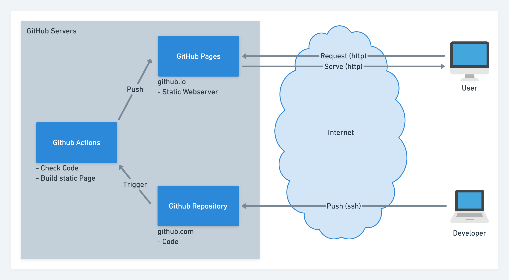
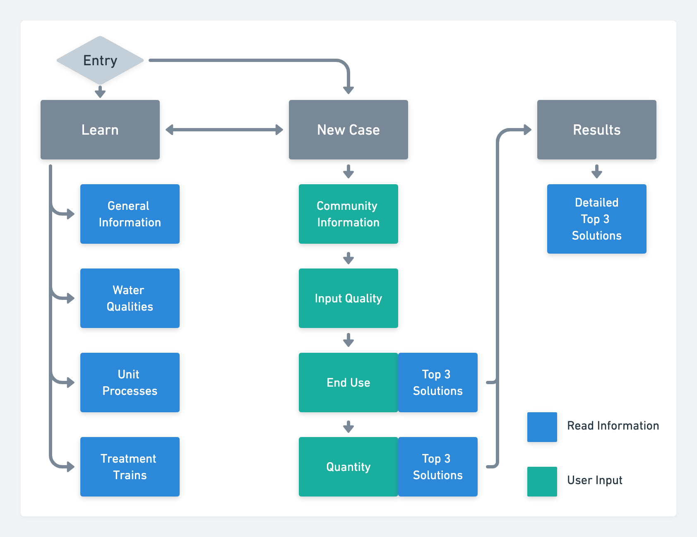

= Poseidon Web 💧

This Poseidon – Web on-line application is an update of the already existing developed Poseidon application based on Microsoft Excel. The scope of the new application is to enhance the older version to a more user-friendly decision support tool, that supports pre-feasibility studies and aims at promoting water reuse and building capacities in the field. The tool developed currently encompasses 37-unit processes combined into 70 benchmark treatment trains. It also contains information on water quality standards and typical wastewater qualities. It estimates the removal performances for 12 parameters and the lifecycle costs including distribution.

The tool and all underlying data are open access and under continuous development. The underlying systemic approach of the tool makes it intuitive also for users with limited prior knowledge in the field to identify most adequate solutions based on a multi-criteria assessment. This should help to promote water reuse and spearhead initiates for more detailed feasibility and design commissioning for implementation of water reuse schemes.

== Live Application

https://waterreuseperu.github.io/PoseidonWeb/

== Base Application & Libraries
** The base of the web application is built from an example by @netzwerg: https://github.com/netzwerg/react-you-do-you[react-you-do-you]
** The following libraries are used:
*** https://www.npmjs.com/package/react-router-dom[React-Router] for creating and linking routes
*** https://material-ui.com/[Material-UI] for the design
*** https://nivo.rocks/[Nivo] for creating data visualisations
*** https://redux-toolkit.js.org/[Redux-Toolkit] for state management
*** https://jestjs.io/[Jest] for creating and running tests
*** https://typicode.github.io/husky/#/[Husky] for static code analysis
*** https://react.i18next.com/[i18next] for internationalisation
*** https://github.com/gregnb/mui-datatables[MUI-Datatables] for listing programm data

== Architecture

The following image visualizes the system architecture that enables the deployment and serving of the application through GitHub Services:

This sitemap represents the way the web application is structured:

